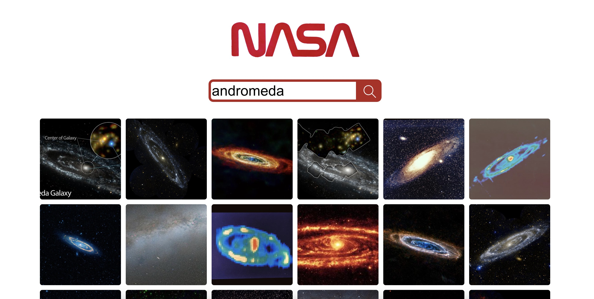
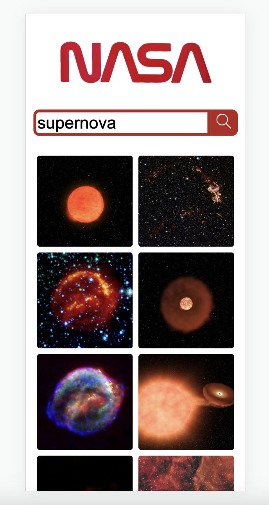

# NASA Image Search App

This is a search engine built using react.js as a practice tech test. It is part of the front end module at [Command Shift](https://www.commandshift.co/). 

This is what it looks like - enter a search term into the search bar and the app will respond with a collection of relevant images.




This is how the app looks on mobile:



## The task requirements

This is a mock tech test, with the following requirements:

-Build a React web application that allows users to search for images based on a query relating to space.

-Consider and add anything to your repository that should be included was this to be a live website.

### Required functionalities

-A search page which allows users to search for images by keyword.
-Images must be returned upon a successful search.

### Resources

-[Image of NASA text](https://cdn.cnn.com/cnnnext/dam/assets/200424060716-nasa-worm-logo.jpg)
-The API endpoint is: GET​​ ​​https://images-api.nasa.gov/search ​Params: ​​q

## API

This app uses the [NASA Images API ](https://images.nasa.gov/docs/images.nasa.gov_api_docs.pdf) from [NASA](https://api.nasa.gov/).

## Testing
This app is tested with [Jest](https://jestjs.io/) and [React Testing Library](https://testing-library.com/docs/react-testing-library/intro/).

## Packages
- [Axios](https://axios-http.com/docs/intro)
- [PropTypes](https://www.npmjs.com/package/prop-types)
- [React Icons](https://react-icons.github.io/react-icons/)


## How to use

### Clone repo

```bash
git clone https://github.com/George-xixi/react-tech-test
```

### Install dependencies

```bash
npm i
```

### Launch app locally

```bash
npm start
```

### To run tests

```bash
npm test
```

## If I had more time...
I would add better alt text to the images in image results. Currently they all have the alt text of "placeholder" which is not useful at all. 

I would need to process the data recieved from the API differently so that the alt text from NASA could be added to the individual image in the same way the href is added to the src attribute.
## Thanks

-Thanks to all the tutors at [Command Shift](https://www.commandshift.co/)!

-Thanks to [NASA](https://api.nasa.gov/) for the API.

### George - 2023
