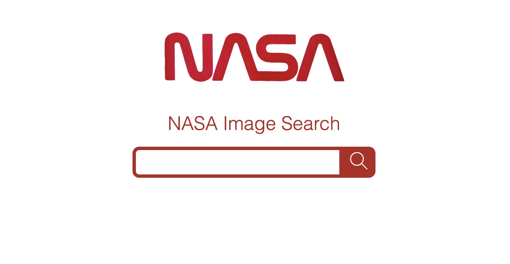

# NASA Image Search App

This is a search engine built using react.js. It is part of the front end module at [Command Shift](https://www.commandshift.co/).

This is what it looks like - enter a search term into the search bar and the app will respond with a collection of relavent images.



## API

This app uses the [NASA Images API ](https://images.nasa.gov/docs/images.nasa.gov_api_docs.pdf) from [NASA](https://api.nasa.gov/).

## How to use

Eventually I will get round to deploying this app.
For now, or if you want to mess around with the inner workings:

### Clone repo

```bash
git clone https://github.com/George-xixi/react-tech-test
```

### Install dependencies

```bash
npm i
```

### Launch app locally

```bash
npm start
```

### To run tests

```bash
npm test
```

## Thanks

-Thanks to all the tutors at [Command Shift](https://www.commandshift.co/)!

-Thanks to [NASA](https://api.nasa.gov/) for the API.

### George - 2023
